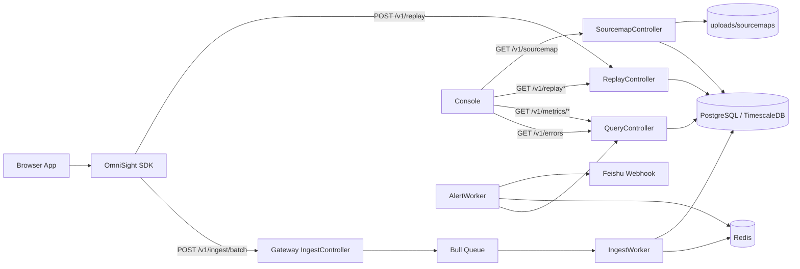

# OmniSight 架构设计与数据链路

## 1. Monorepo 结构

```text
OmniSight/
├─ apps/
│  ├─ sdk/        浏览器采集 SDK
│  ├─ gateway/    NestJS 数据接入与查询网关
│  └─ console/    React 可视化控制台
├─ packages/
│  ├─ shared-types/  共享事件类型定义
│  └─ ui-components/ 公共 UI 组件
├─ infra/
│  └─ scripts/init.sql  数据库初始化脚本
└─ docs/
```

## 2. 为什么用 Monorepo

我建议你在面试时不要只说“方便管理”，而是具体说：

- SDK、Gateway、Console 三端共享的是同一套事件模型，拆成多仓库后类型契约很容易漂移。
- Monorepo 可以把共享类型、接口约定、构建脚本和本地联调环境收在一起。
- 对这种“强协作、强联调”的系统，Monorepo 的收益明显高于普通业务项目。

## 3. 整体架构图



## 4. 三条最关键的数据链路

### 4.1 错误采集链路

1. SDK 捕获浏览器错误。
2. Core 为错误生成 `fingerprint`。
3. 客户端做会话内短时防抖，但会累计 `occurrences`。
4. BatchTransport 批量发送到 `/v1/ingest/batch`。
5. Gateway 先入 Bull Queue，不阻塞上报接口。
6. Worker 做事件级去重后写入 `events` 表。
7. QueryService 按 `fingerprint` 聚合，统计 `count` 与 `affectedUsers`。
8. Console 展示错误列表和错误详情。

### 4.2 错误回放链路

1. SDK 初始化 replay 后，rrweb 持续录制到内存 Ring Buffer。
2. 一旦出现错误，不立即上传，而是等待错误后的观察窗口结束。
3. 上传“错误前 30 秒 + 错误后 10 秒”的事件片段到 `/v1/replay`。
4. Gateway 写入 `replay_sessions` 表。
5. Console 通过 `/v1/replay/:sessionId` 取回 rrweb 事件并用 `rrweb-player` 回放。

### 4.3 告警链路

1. 定时任务扫描最近一段时间内的高频错误。
2. 以 `appId + fingerprint` 为粒度做窗口聚合。
3. 按 `SUM(occurrences)` 统计真实错误次数。
4. 用 Redis 做冷却控制，避免同一错误反复告警。
5. 组装飞书卡片并发送。

## 5. 为什么接入层先入队，不直接入库

这题很容易被问。

推荐回答：

> 因为 SDK 上报接口是用户请求链路的一部分，我更关心接入时延而不是当场把数据处理完。直接写库意味着 Controller 要承担去重、校验、富化、入库等开销，而先入 Bull Queue 可以把“快速接收”和“慢处理”拆开。这样上报接口能更快返回，Worker 侧也更适合做重试和批量处理。

## 6. 为什么服务端不能按 fingerprint 去重

这是这个项目里很容易拉开差距的一题。

错误做法：

- 同一个 `fingerprint` 只留一条

后果：

- `count` 失真
- `affectedUsers` 失真
- 高频错误扫描失真
- 告警次数失真

正确做法：

- 客户端可以为了防风暴做短时防抖
- 服务端只能做“同一事件重复投递”的幂等去重
- 服务端聚合时按 `SUM(occurrences)` 恢复真实次数

## 7. `count` 和 `affectedUsers` 的定义

这个项目里一定要把统计口径讲清楚。

### `count`

- 含义：错误真实发生次数
- 计算方式：`SUM(occurrences)`
- 不是简单的事件行数

### `affectedUsers`

- 含义：受影响的去重 audience
- 当前实现：优先按 `payload.userId` 去重，否则退化为 `session_id`
- 所以这个字段本质是“影响人数 / 影响会话”的折中统计

## 8. 为什么要有 `occurrences`

这是你最值得讲透的设计点之一。

问题背景：

- 营销页、活动页停留时间短
- 同一 session 内 60 秒防抖如果只保留 1 条事件，真实次数会被严重压缩

解决方案：

- 首次错误立即上报，保证实时性
- 窗口内重复错误不立即上报，避免风暴
- 但在客户端内存里累计重复次数
- 超时或页面卸载时补发一条聚合错误，带上 `occurrences`
- 服务端统计和告警按 `SUM(occurrences)` 计算

这套设计的优点是：

- 保住了防抖
- 保住了真实统计
- 适合页面停留很短的场景

## 9. 数据库设计为什么是一张 `events` 总表 + JSONB payload

推荐回答：

> 因为这个系统的事件类型很多，字段差异也很大。如果每种事件建一张表，扩展成本高，而且跨类型做时间维度查询会比较碎。当前实现采用一张 `events` 总表，固定列存放 `app_id/session_id/type/ts/fingerprint` 这些公共字段，类型特有字段放 `payload JSONB`。这样既保留了查询统一入口，又让模型扩展比较灵活。

再补一句会更好：

> 同时因为 `events.ts` 是 TimescaleDB 的时间分区键，所以时序查询和 retention policy 也更自然。

## 10. 架构 Q&A

### Q1：为什么不直接用 Kafka？

因为这个项目的目标是作品级闭环系统，不是超大规模日志平台。Bull + Redis 已经足够覆盖“异步解耦、重试、低延迟接入”这几个核心诉求，复杂度更低，也更适合快速落地和演示。

### Q2：为什么回放不全量录制？

全量录制成本太高，而且有隐私问题。这个项目采用错误触发式上传，只保留有问题的窗口，能兼顾定位能力和成本控制。

### Q3：为什么 `replay_sessions` 单独建表，不放进 `events`？

因为 rrweb 事件数组体积很大，访问模式也完全不同。错误事件更适合聚合查询，回放数据更适合按 session 定位。分表可以避免查询和存储策略互相污染。

### Q4：为什么 SourceMap 不直接公开部署？

因为 `.map` 文件里包含源码映射信息，公开暴露会带来安全风险。更合理的做法是 CI 上传到服务端，错误定位时由后端读取映射。
